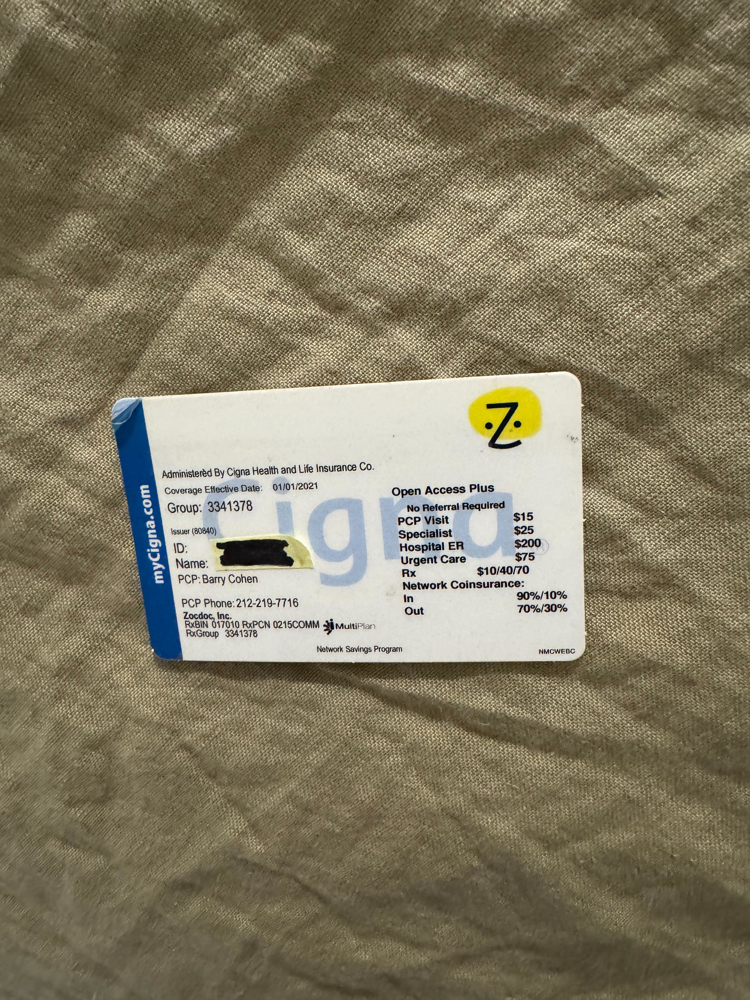

# What is this?

This is a simple web service with one endpoint:

`POST /image`

which accepts raw image data associated with the key `image` in multiple forms (as a multipart form data request, as a JSON object with a Base64-encoded value, etc) and returns a JPEG image directly on success.

This is based on an original implementation baked into the iOS app written in 2016 or so that hasn't been meaningfully updated since. There's plenty of opportunity to improve this!

# How to run

Open the project in XCode.

# Sample Results

Sources images are in the `other/test` folder. Use the included Postman collection for convenience:

| # | Original | Extracted |
| -- | -- | -- |
| 1537 |  |  |
| 1538 |  |  |
| 1539 |  |  |
| 1540 |  |  |
| 1541 |  | `fail` |
| 1543 |  |  |
| 1544 |  |  |

